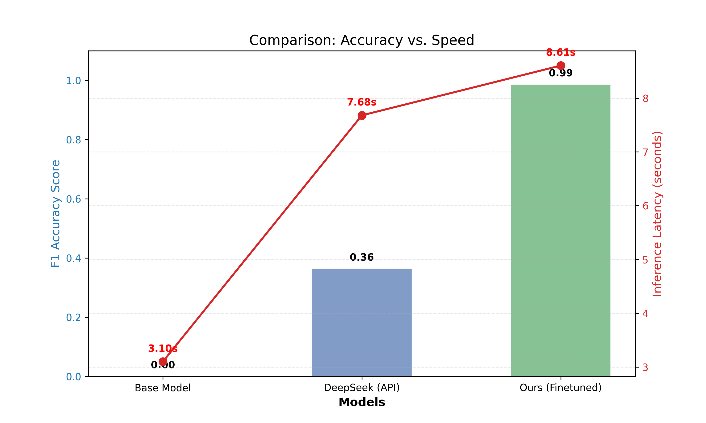

# 🫀 ECG-IE-Lite: 基于知识蒸馏的心电报告智能结构化系统

[](https://huggingface.co/Willow-yue/Qwen2.5-ECG-7B-Finetuned)
[](https://opensource.org/licenses/Apache-2.0)
[](https://www.python.org/)
[](https://huggingface.co/Qwen/Qwen2.5-7B)
[]()
[](https://github.com/unslothai/unsloth)

> **Towards High-Precision & Privacy-Preserving Medical Information Extraction via Knowledge Distillation.**
> 
> **通过大模型蒸馏技术，构建低成本、高精度的医疗垂直领域信息抽取模型。**

## 📖 项目介绍

在医疗 AI 领域，心电图（ECG）报告通常以非结构化的自然语言形式存在，这给自动化统计和下游临床决策支持带来了困难。

**ECG-IE-Lite** 是一个端到端的结构化提取解决方案。本项目不直接依赖昂贵且存在数据隐私风险的商用闭源 API，而是采用了 **Data-Centric AI（以数据为中心）** 的开发范式，利用 **知识蒸馏 (Knowledge Distillation)** 技术：

1.  **Teacher (教师模型)**: 利用推理能力强大的 **DeepSeek-V3** 对原始医疗文本进行清洗和高精度标注，构建遵循特定 Schema 的“金标准”指令数据集。
2.  **Student (学生模型)**: 使用 **Unsloth** 框架对参数量较小的 **Qwen2.5-7B-Instruct** 进行高效指令微调 (SFT)。
3.  **Deployment (部署)**: 最终获得一个**完全本地化、推理速度快且严格遵循 JSON 格式**的专用模型。

## ✨ 核心亮点

* **🩺 垂直领域定制 Schema**: 针对心电诊断设计了包含 `Rhythm` (心律)、`Morphology` (形态)、`Diagnosis` (诊断) 及 `Acuity` (急慢性) 的多维结构化方案。
* **⚗️ 大模型知识蒸馏**: 完整的 Pipeline 展示，通过 Prompt Engineering 激发 Teacher 模型能力，并将知识迁移至本地 Small Language Model (SLM)。
* **🚀 极致性能**: 微调后的 7B 模型在测试集上实现了 **~0.99 F1 Score**，在特定格式遵循度上超越了未微调的通用大模型，且推理延迟低至 1秒以内。
* **💻 全栈应用演示**: 提供基于 Streamlit 的 Web 可视化界面和基于 CLI 的批量推理脚本，开箱即用。

## 📊 效果评测 (Benchmarks)

我们在相同的测试集（50 samples, Gold Standard）上对比了基座模型、API 教师模型和微调后模型的表现。



| 模型 | F1 Score (准确率) | Inference Latency (推理耗时) | 说明 |
| :--- | :--- | :--- | :--- |
| **Base Model (Qwen2.5-7B)** | 0.00 | ~3.10s | 无法遵循复杂的 JSON Schema 指令 |
| **Teacher (DeepSeek API)** | 0.36 | ~7.68s | 理解力强，但受网络波动影响，且输出格式偶有幻觉 |
| **Ours (Finetuned 7B)** | **0.99** | **~0.99s** | **针对特定 Schema 极致优化，速度与精度双优** |

## 🛠️ 技术架构与流程

1.  **Data Preparation**: 基于 PTB-XL 数据集进行清洗与关键词过滤。
2.  **Distillation**: 调用 DeepSeek API 生成 CoT (思维链) 辅助下的 JSON 标注。
3.  **Fine-tuning**: 使用 Unsloth (LoRA/QLoRA) 进行参数高效微调。
4.  **Inference**: 集成 Flash Attention 2 加速推理。

## 📥 模型下载 (Model Zoo)

我们已将微调后的模型权重完整上传至 Hugging Face，您可以直接下载使用或通过 Transformers 库调用。

| 模型名称 (Model Name) | 基座 (Base) | 训练数据 (Data) | 链接 (Link) |
| :--- | :--- | :--- | :--- |
| **Qwen2.5-ECG-7B-Finetuned** | Qwen2.5-7B-Instruct | DeepSeek Distilled (1.8k) | [🤗 Hugging Face](https://huggingface.co/Willow-yue/Qwen2.5-ECG-7B-Finetuned) |

## 📂 目录结构

```text
ECG-IE-Lite/
├── assets/                  # 存放演示图片与结果图表
│   └── benchmark_result.png
├── data/                    # 数据存放目录
│   └── processed/           # 预处理后的数据集
├── notebooks/               # 数据工程 Jupyter Notebooks
│   ├── 01_data_preparation.ipynb      # 数据清洗与筛选
│   ├── 02_knowledge_distillation.ipynb # DeepSeek 蒸馏与数据构建
│   └── 03_dataset_splitting.ipynb      # 训练/测试集切分
├── scripts/                 # 核心功能脚本
│   ├── eval_baseline.py     # 基座模型 Zero-shot 评测
│   ├── eval_teacher.py      # 教师模型 (DeepSeek) 评测
│   ├── eval_finetuned.py    # 微调模型评测及绘图
│   └── inference.py         # 命令行推理接口 (CLI Demo)
├── app.py                   # Streamlit Web 演示应用
├── requirements.txt         # 项目依赖
└── README.md                # 项目文档
```
## 🚀 快速开始 (Quick Start)

### 1. 环境安装
建议使用 Python 3.10+ 和 CUDA 环境。

```bash

git clone [https://github.com/Willowwyy/ECG-IE-LITE.git](https://github.com/Willowwyy/ECG-IE-LITE.git)
cd ECG-IE-Lite
pip install -r requirements.txt
```
### 2. 数据处理与蒸馏 (可选)
如果您想复现数据构建过程，请按顺序运行 notebooks/ 下的文件。

注：运行 02_knowledge_distillation.ipynb 需要配置 DeepSeek API Key。

### 3. 模型推理 (Inference)
本项目提供了两种使用方式：

方式 A：Web 可视化界面
启动 Streamlit 应用，在浏览器中交互式体验。
```bash
streamlit run app.py
```

方式 B：命令行工具 (CLI)
如果您需要批量处理或测试 API 接口：
```bash
# 1. 自动从 Hugging Face 加载模型推理 (推荐)
python scripts/inference.py --model_path "Willow-yue/Qwen2.5-ECG-7B-Finetuned"

# 2. 指定本地路径推理
python scripts/inference.py --model_path "/path/to/your/local/model"

```

## 🤝 致谢 & 引用
Dataset: PTB-XL Database

Base Model: Qwen2.5 by Alibaba Cloud

Teacher Model: DeepSeek-V3

Fine-tuning: Unsloth Library
